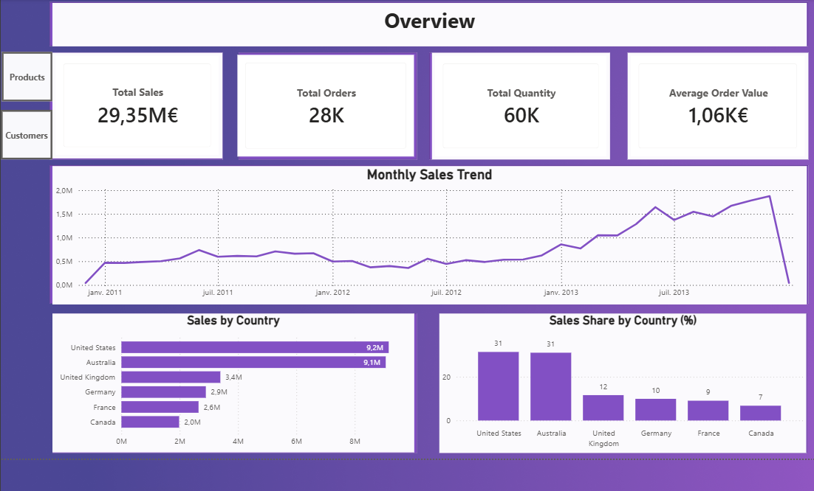
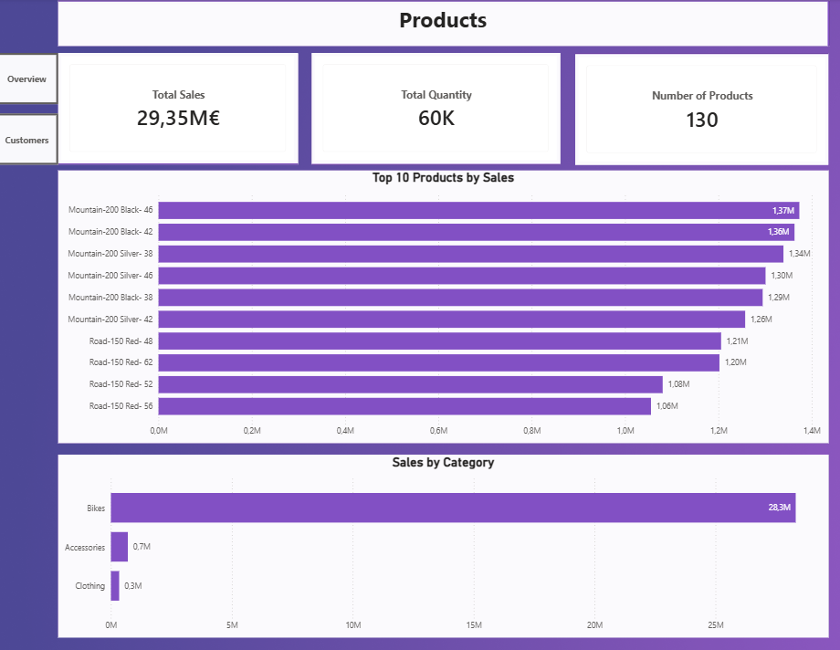
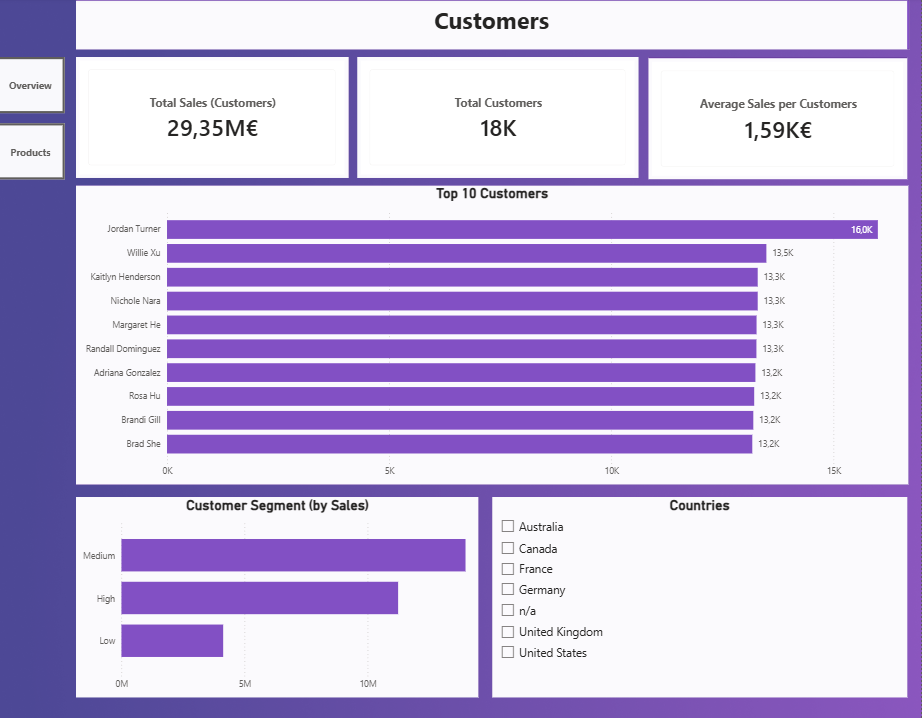

# Sales Analysis Dashboard

## Project Overview

This project is a Power BI dashboard built to analyze sales performance across multiple business dimensions:

* Global sales overview and KPI tracking
* Product performance analysis
* Customer segmentation and customer behavior analysis

## Tools Used

* **SQL Server** for data transformation and view creation
* **Power BI** for data modeling, DAX measures, and dashboard creation

## Dashboard Structure

### Overview

Provides a high-level business summary including:

* Total Sales, Orders, Quantity, and Average Order Value
* Monthly Sales Trend
* Sales by Country
* Sales Share by Country

---

### Products

Focuses on product and category performance:

* Top 10 Products by Sales
* Sales by Category
* Product KPIs

---

### Customers

Analyzes customer performance and segmentation:

* Top 10 Customers by Sales
* Customer Segmentation
* Sales by Customer Segment
* Country Filter for Dynamic Analysis

---

## Key Business Insights Delivered

* Identification of top-performing products and categories
* Customer segmentation based on total sales
* Revenue distribution by country and customer segment
* Monthly growth and trend analysis

## Repository Contents

* `sales_dashboard.pbix` / Power BI dashboard file
* `views.sql` / SQL views used for transformations
* Dashboard screenshots for preview
